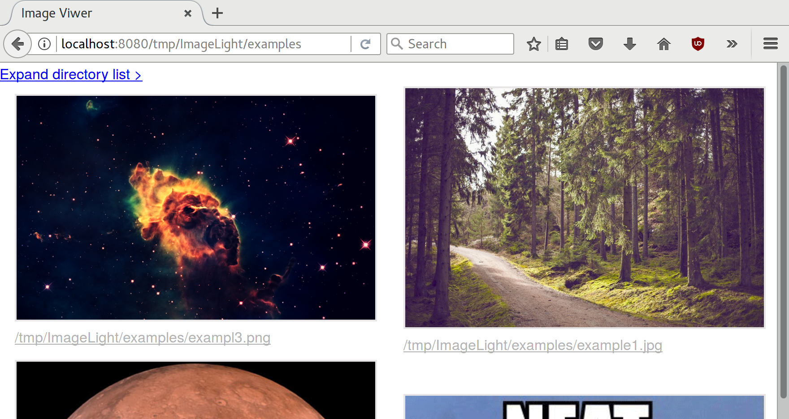

# Lightweight Image Viewer
A lightweight, browser-based image viewer originally made to view enormous amounts of images on headless servers.  

I suggest not running this on any port that is open to the internet.

## How to run it

```go run main.go```  

The program is now listening on port `8080`

## How to use it

Everything after the port in the URL is considered a path to a directory.  
To view the example images you have to visit this URL in your browser:
```http://localhost:8080/tmp/ImageLight/examples```



